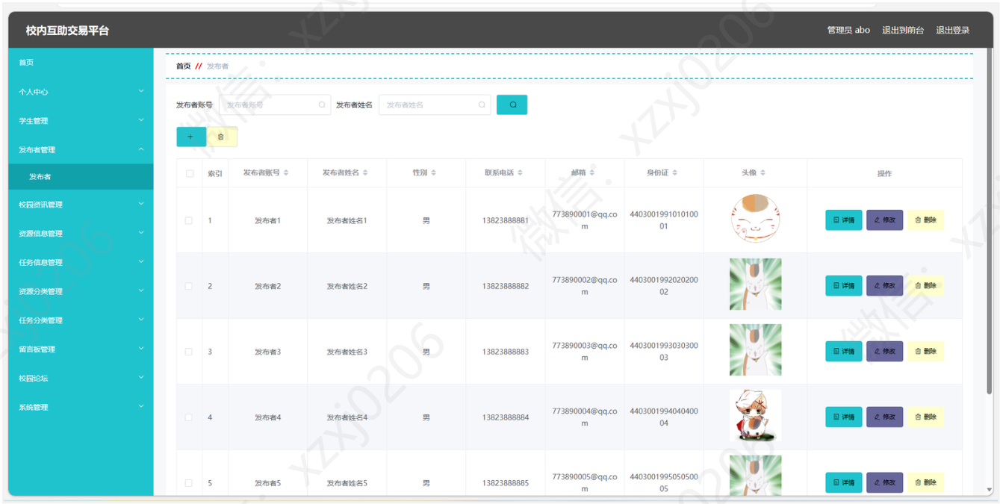
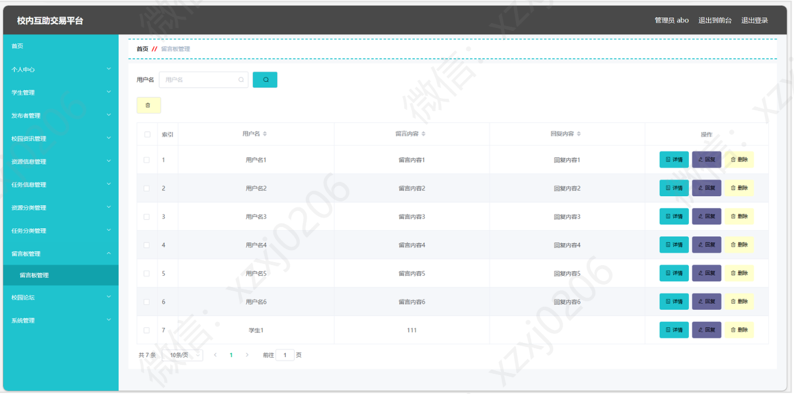
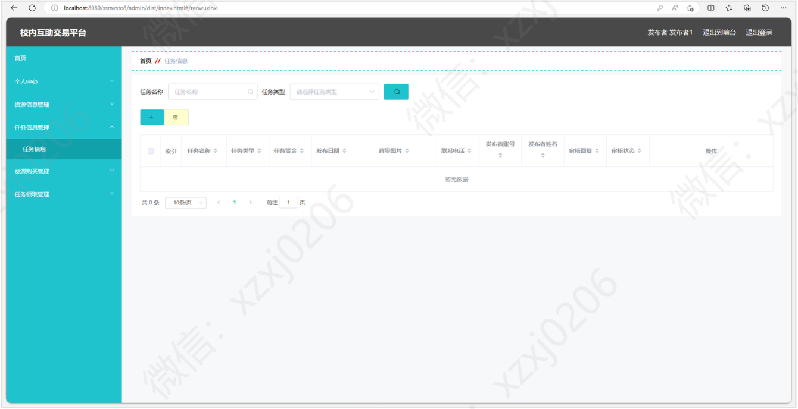

# 校园互助系统

### 有问题，或者不会调试运行的同学, 可以添加微信：xzxj0206

## 一、介绍

基于springboot+vue 的校园互助管理系统

## 二、软件架构

软件架构说明

基于springboot  vue  校园互助管理系统

主要技术：Java,Springboot,mybatis,mysql,jquery,html,vue

主要功能实现

前台部分：首页列表显示，资源信息查看，任务信息领取，收藏，评论，校园论坛发帖子，留言反馈等

后台部分：分三种角色，管理员，学生和发布者，不同角色不同权限，包含个人中心，学生管理，发布者管理，咨询信息管理，资源信息管理，任务信息管理，资源分类管理，留言板，校园论坛等功能

## 三、系统运行界面

## 四、学生模块部分功能界面展示

## 五、管理员模块部分功能界面展示

## 六、发布者模块部分功能界面展示

