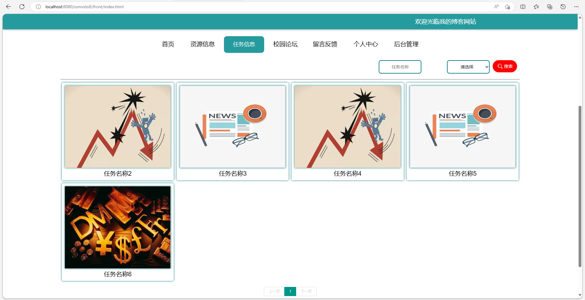

# 校园互助系统
### 9.9￥ 获取完整源码+sql，附赠万字论文参考，需要加Q：3808981644 备用Q：3577148218
### 有问题，或者需要协助调试运行项目的也可联系
### 获取更多项目，关注公众号：编程项目集

## 一、介绍

运行环境:idea或eclipse 数据库:mysql

开发语言：java

基于springboot+vue 的校园互助管理系统

## 二、软件架构

软件架构说明

基于springboot+vue的校园互助管理系统

主要技术：Java,Springboot,mybatis,jquery,vue

主要功能实现

前台部分：首页列表显示，资源信息查看，任务信息领取，收藏，评论，校园论坛发帖子，留言反馈等

后台部分：分三种角色，管理员，学生和发布者，不同角色不同权限，包含个人中心，学生管理，发布者管理，咨询信息管理，资源信息管理，任务信息管理，资源分类管理，留言板，校园论坛等功能

## 三、部分功能界面展示

## 四、带万字论文参考

## 9.9￥ 获取完整源码+sql，附赠万字论文参考，需要加Q：3808981644 备用Q：3577148218
## 有问题，或者需要协助调试运行项目的也可联系

